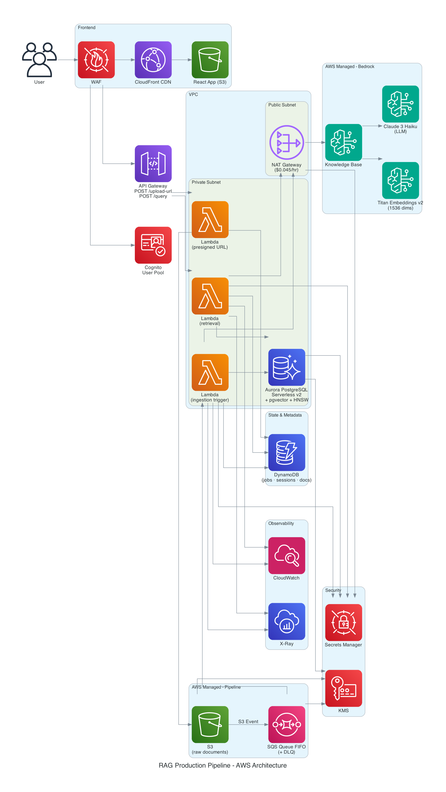

# RAG Production Pipeline

Production-grade Retrieval-Augmented Generation on AWS. Event-driven document ingestion via Bedrock Knowledge Bases, vector storage on Aurora pgvector with HNSW indexing, session state on DynamoDB, deployed with Terraform and GitHub Actions.



---

## What This Demonstrates

- **Event-driven CDC ingestion** - S3 Events → SQS FIFO → Lambda → Bedrock KB. Only new or changed documents trigger re-processing. Deduplication via S3 ETag.
- **Fully managed RAG** - Bedrock Knowledge Bases handles chunking, Titan embeddings, and Aurora pgvector upserts in one API call. Three Lambda functions total ~50 lines of Python.
- **Production security** - Cognito invite-only with OTP MFA, WAF Managed Rules, KMS encryption at rest, VPC isolation, IAM least privilege per Lambda.
- **Operational readiness** - Structured JSON logs, CloudWatch alarms on error rate and p99 latency, X-Ray tracing, DynamoDB job status tracking, SQS DLQ with SNS alerting.
- **Infrastructure as code** - Terraform modules with remote state on S3 + DynamoDB lock, separate environments (dev / staging / prod).
- **Planned evolution** - Roadmap with three phases: core pipeline, production hardening (re-ranking, ACL, VPC endpoints), advanced ML (HyDE, semantic caching, model routing). Each phase documented with rationale.

---

## Docs

| | |
|---|---|
| [Architecture](docs/architecture.md) | Flows, API routes, who owns what, job states |
| [Stack](docs/stack.md) | Every service, why it was chosen, configuration details |
| [Roadmap](docs/roadmap.md) | Phase 1 / 2 / 3 with rationale for each item |
| [Data Model](docs/data-model.md) | DynamoDB schemas, S3 layout, Aurora, CloudWatch logs |
| [Cost](docs/cost.md) | Monthly estimate, cost reduction strategies, Bedrock pricing |
| [ADR 001 - Aurora vs OpenSearch](docs/adr/001-aurora-vs-opensearch.md) | Why pgvector over OpenSearch Serverless ($43/month vs $345/month) |
| [ADR 002 - NAT Gateway vs VPC Endpoints](docs/adr/002-nat-gateway-vs-vpc-endpoints.md) | Phase 1 NAT GW, Phase 2 migration to PrivateLink |
| [ADR 003 - Session Deletion on Right to Be Forgotten](docs/adr/003-session-deletion-on-document-delete.md) | How session history is handled when a document is deleted (GDPR art. 17) |
| [SLO](docs/slo.md) | Latency, availability, ingestion health targets with error budgets |
| [OpenAPI Spec](openapi.yaml) | API-first contract: defines all 4 endpoints before implementation. Pydantic models and test validators are generated from this file. |

---

## Quick Start

```bash
# local development (Postgres + pgvector + LocalStack)
docker-compose up

# test Titan embeddings against real Bedrock (requires AWS credentials)
python ingestion/test_embedding.py

# run tests
pytest tests/

# deploy to dev
cd infra/envs/dev && terraform init && terraform apply

# regenerate architecture diagram
pip install diagrams && python diagram.py
```

---

## Project Structure

```
rag-production-pipeline/
├── ingestion/          # Lambda: presigned URL + ingestion trigger
├── retrieval/          # Lambda: retrieval + session management
├── evaluation/         # RAGAS evaluation pipeline
├── observability/      # CloudWatch metrics publisher, structured logger
├── infra/
│   ├── modules/
│   │   ├── networking/      # VPC, subnets, NAT Gateway
│   │   ├── ingestion/       # S3, SQS FIFO, event notifications
│   │   ├── knowledge_base/  # Bedrock KB + Aurora pgvector
│   │   ├── metadata/        # DynamoDB tables
│   │   ├── retrieval/       # API Gateway, Lambda
│   │   ├── security/        # Cognito, Secrets Manager, KMS, WAF, IAM
│   │   ├── frontend/        # S3 static hosting, CloudFront
│   │   └── observability/   # CloudWatch, SNS, X-Ray
│   ├── backend.tf           # Remote state: S3 + DynamoDB lock
│   └── envs/
│       ├── dev/
│       ├── staging/
│       └── prod/
├── frontend/           # React app
├── tests/
├── docs/               # Architecture, stack, roadmap, data model, cost, ADRs
├── images/             # Architecture diagrams
├── diagram.py          # Generates images/architecture_v9.png
├── .github/workflows/  # GitHub Actions CI/CD
└── docker-compose.yml
```

---

## Status

Phase 1 architecture defined. Implementation in progress.
